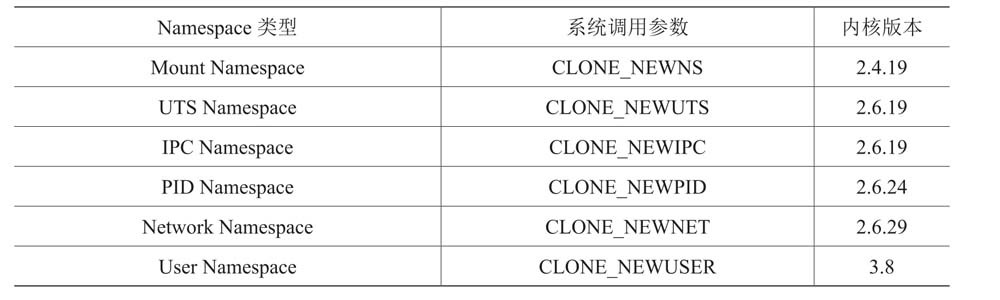

## namespace

Linux Namespace 的作用是隔离各种资源，当前一共有六种不同类型的 Namespace

*上图的“系统调用参数”是系统调用中同一个参数的不同标志位*

|||
|---|---|
Mount   | 隔离文件系统挂载点。每个容器能看到不同的文件系统层次结构。
UTS     | 隔离主机名和域名。
IPC     | 隔离System V IPC和POSIX消息队列。
PID     | 隔离进程ID。
Network | 隔离网络资源。
User    | 隔离用户ID和组ID。

Namespace的API主要使用如下3个系统调用。

- `int clone(int (*child_func)(void *), void *child_stack, int flags, void *arg);` 创建新进程。根据系统调用参数来判断哪些类型的Namespace被创建，而且它们的子进程也会被包含到这些Namespace中。
- `int unshare(int flags);` 将进程移出某个Namespace。
- `int setns(int fd, int nstype);` 将进程加入到Namespace中。

### UTS Namespace

UTS Namespace 用来隔离 `struct utsname` 结构体里的nodename和domainname这两个字段。

### IPC Namespace

IPC Namespace 针对的是 SystemV IPC 和 Posix 消息队列。这些 IPC 机制都会用到标识符，例如用标识符来区别不同的消息队列，然后两个进程通过标识符找到对应的消息队列进行通信等。  
IPC Namespace 能做到的事情是，使相同的标识符在两个 Namespace 中代表不同的消息队列，这样也就使得两个 Namespace 中的进程不能通过 IPC 进程通信了。

### PID Namespace

PID Namespace 用于隔离进程 PID 号，同一个进程在容器内外的进程号是不同的。

### Mount namespace

Mount namespace 通过隔离文件系统挂载点对隔离文件系统提供支持，进程在创建mount namespace 时，会把当前的文件结构复制给新的 namespace。新 namespace 中的所有 mount 操作都只影响自身的文件系统，而对外界不会产生任何影响。这样做非常严格地实现了隔离，但是某些情况可能并不适用。比如父节点 namespace 中的进程挂载了一张 CD-ROM，这时子节点 namespace 拷贝的目录结构就无法自动挂载上这张 CD-ROM，因为这种操作会影响到父节点的文件系统。

### Network Namespace

Network Namespace 是用来隔离网络设备、IP地址、路由表、/proc/net目录、端口号等。  
在宿主机上搭建网桥后，就能很方便地实现容器之间的通信，而且不同容器上的应用可以使用相同的端口。

### User Namespace

User Namespace 用来隔离用户和组ID，也就是说一个进程在 Namespace 里的用户和组ID与它在 host 里的ID可以不一样。  
User Namespace最有用的地方在于，host的普通用户进程在容器里可以是0号用户，也就是root用户。这样，进程在容器内可以做各种特权操作，但是它的特权被限定在容器内，离开了这个容器它就只有普通用户的权限了。

### 参考文献

- 自己动手写Docker - 陈显鹭
- https://segmentfault.com/a/1190000016357628